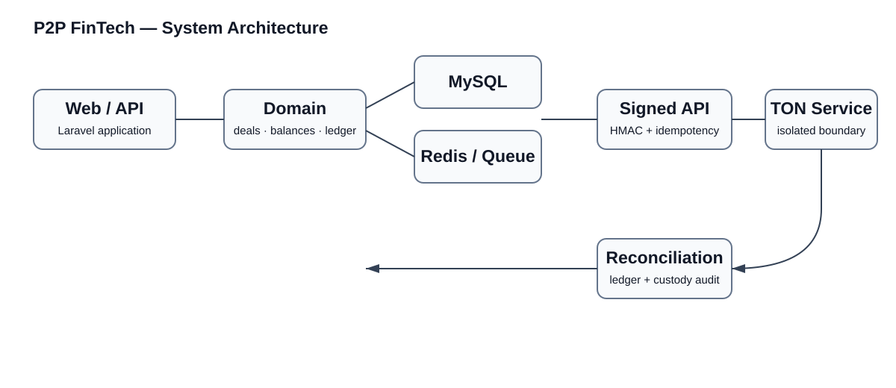
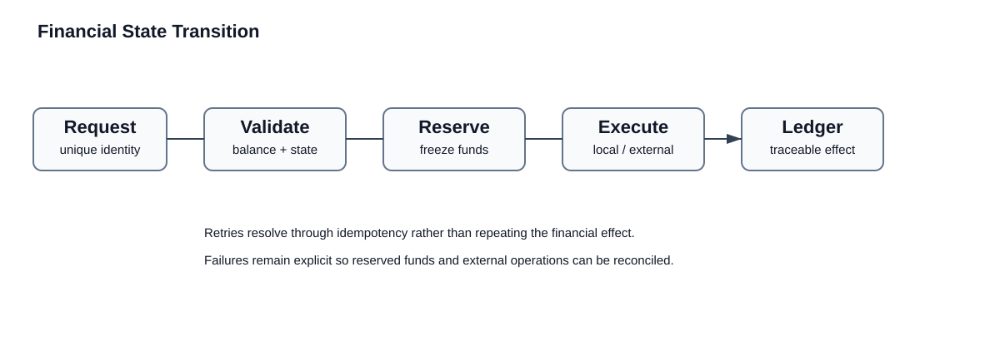
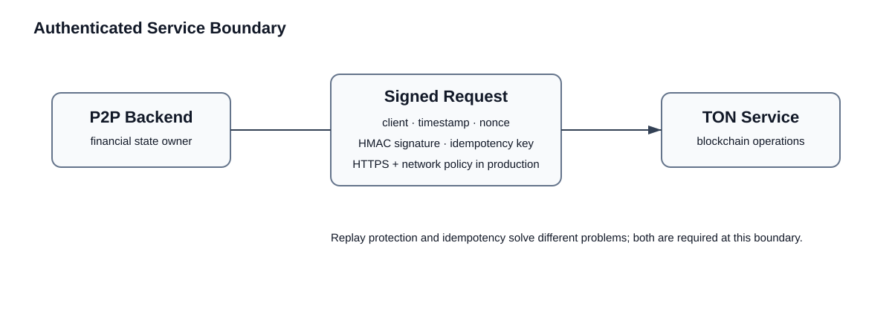

# P2P FinTech — Architecture Case Study

A technical case study of a production P2P platform built around financial state, internal ledgers, TON/Jetton operations, and a separately isolated blockchain service.

The production application is private. This repository documents selected architecture and reliability patterns without publishing production source code, credentials, wallet addresses, customer data, internal hostnames, or deployment configuration.

## Engineering focus

The interesting part of a P2P platform is not the CRUD around offers and deals. It is preserving financial invariants when requests are retried, external services fail, blockchain events arrive more than once, or application processes stop midway through an operation.

The system therefore treats financial operations as explicit state transitions backed by:

- balance reservation and frozen funds
- append-style ledger entries
- idempotency keys
- database locking where state changes require serialization
- deposit and withdrawal lifecycle tracking
- HMAC-authenticated service communication
- replay protection with timestamps and nonces
- reconciliation and custody audits
- explicit failure states and recovery paths

## Core stack

- Laravel / PHP
- MySQL
- Redis
- Laravel Queues / Scheduler
- Docker / Linux
- Vue / Inertia
- TON / Jetton integration
- Separate blockchain service
- HMAC-signed internal API

## High-level architecture

The web application owns users, deals, balances, financial state, and the audit trail. Blockchain-specific operations are isolated behind a separate service boundary.

## Financial flow

A financial mutation is not considered safe merely because an HTTP request returned successfully. The application records enough state to determine what happened and to reconcile internal accounting against confirmed external operations.

## Service boundary

Sensitive service-to-service operations use a signed request model with a client identifier, timestamp, nonce, request signature, and idempotency key. Production policy can additionally require HTTPS and a restricted source network.

See [Service security](docs/service-security.md).

## Ledger and balances

The application distinguishes available and reserved/frozen funds. Ledger entries reference the operation that caused a balance change and carry an idempotency identity.

This supports several important properties:

- the same external event should not credit a user twice
- a withdrawal retry should not reserve funds twice
- a failed operation can retain enough state for investigation
- current balances can be compared with ledger-derived expectations
- blockchain state can be reconciled against internal liabilities

See [Ledger design](docs/ledger.md).

## Deposits

Blockchain deposits have identities independent of the HTTP request that reports them. The application records external identifiers and transaction information and protects crediting with idempotency constraints.

A repeated delivery of the same confirmed event must resolve to the existing operation instead of creating a second credit.

## Withdrawals

Withdrawals have an explicit lifecycle and retain both local and remote identities. Funds can be reserved before the external operation is submitted and then finalized or released according to the resulting state.

The integration checks that an existing local withdrawal cannot silently become associated with a different remote operation.

See [Failure recovery](docs/failure-recovery.md).

## Reconciliation

The system includes reconciliation tooling for comparing account balances with unique confirmed deposits and withdrawals.

Reconciliation is deliberately separate from normal request processing: it provides a way to detect drift, inspect differences, and apply controlled corrections instead of hiding inconsistencies.

## Custody auditing

For TON custody, the system can compare internal liabilities against externally reported assets and record the difference for operational review.

The objective is not to assume that either side is always correct. It is to make discrepancies observable.

## Idempotency

Idempotency is applied at several boundaries:

- API requests
- deposit ingestion
- withdrawals
- ledger entries
- external service operations

See [Idempotency](docs/idempotency.md).

## Why this repository exists

FinTech reliability comes from controlling state transitions and failure modes, not from a successful API demo.

This repository demonstrates the engineering patterns used to make financial operations traceable, retry-safe, auditable, and recoverable while keeping the production application private.
